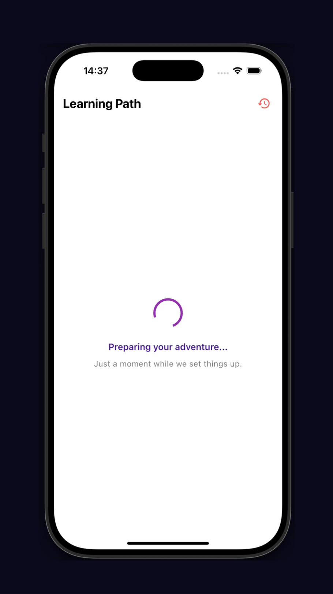
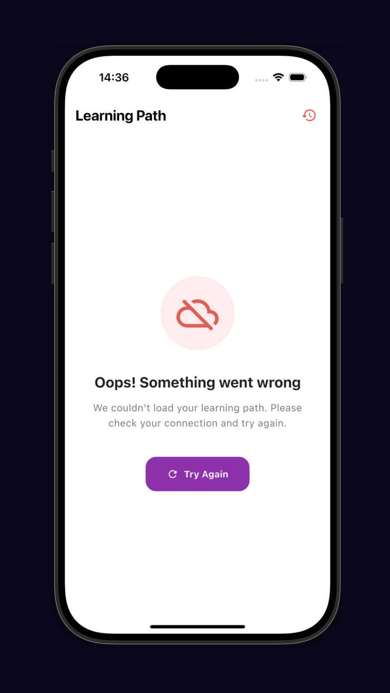

# learning_path

## Desafio Técnico 

### Proposta

Criar um aplicativo com uma trilha de aprendizado usando uma base json local mostrando seu progresso por lesson e por trilha. A ideia é que seja um projeto simples, criado em até 6 horas pra mostrar o potencial de desenvolvimento de cada candidato.

[Resultado](#resultado-do-desafio)

### Arquitetura: Clean Architecture
Optei por seguir com clean arch, por ser uma arquitetura bem "badalada" no mercado e que permite isolar as responsabilidades de forma mais clara. Pra apps pequenos como este, normalmente não seguiria com clean arch e todas as suas camadas, porém por se tratar de um desafio técnico, optei por seguir dessa forma pra mostrar o que posso fazer.

### Gestão de estado: Riverpod
Normalmente eu gosto de utilizar cubit nos meus projetos, mas pra este desafio, optei por seguir com Riverpod por se adequar melhor com a Clean Architecture, proporcionando um código mais limpo e organizado e com muito menos boilerplate.

### Como rodar o projeto:
- Clone o repositório
- Com um terminal aberto, já configurado com o flutter, execute o comando: flutter pub get
- Depois disso, execute o comando: flutter run

Ou se preferir, e estiver utilizando VSCode, basta clicar no botão "Run" no canto superior direito do editor.

### Próximos passos

- Criação de outras camadas no Core para buscar os paths de forma remota
- Localization pra internacionalização
- Observabilidade de crashes com Crashlytics

### Resultado do desafio

